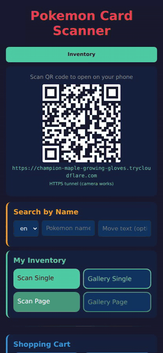
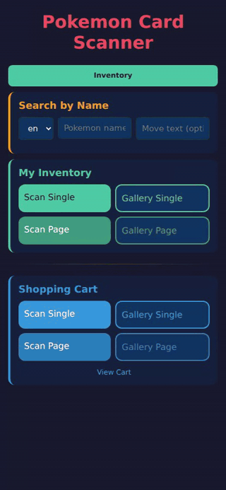

# cardprice

Pokemon card scanner and price tracker. Photograph a 9-card binder page,
get all 9 cards identified with current market prices in seconds; or
search by name to look up any card's condition-stratified pricing and
recent sales history.

## Demos

### Scan a binder page

  

Upload a photo of a 3×3 binder page and watch the scan timer tick. When
the pipeline finishes, all nine cards come back labeled with current
market prices for each condition. Tapping a card opens its detail page
with sales history.

### Search any card

  

Type a Pokemon name, get instant autocomplete across every printing in
the catalog. Tap a result for the full detail page: image, MP/LP/NM/HP/DMG
prices, recent sales table, and a TCGplayer link.
