# Variant Detection Ground Truth Gallery

Visual reference images for Pokemon card variant types.
Images resized to 400px max width for git-friendliness.

**Total images:** 672

## Variant Types

### [1st_edition/](1st_edition/)
Cards with the 1st Edition stamp (black circle with '1' and 'EDITION'). Base Set through Neo Destiny.
*135 images*

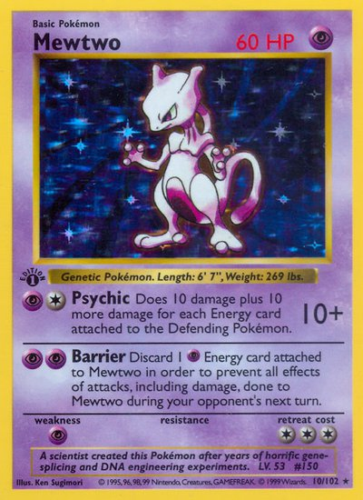
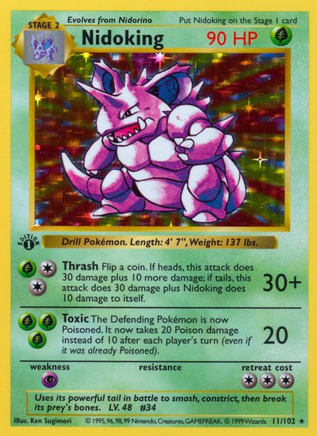
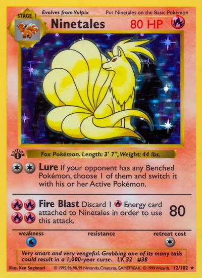

### [break/](break/)
XY-era BREAK evolution cards with horizontal/landscape orientation and golden border.
*10 images*

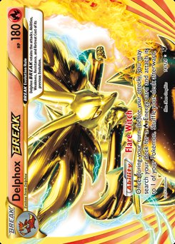
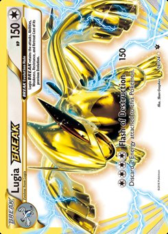
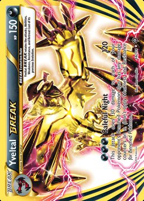

### [build_battle/](build_battle/)
Stamped promo cards from Build & Battle boxes at pre-release events.
*15 images*

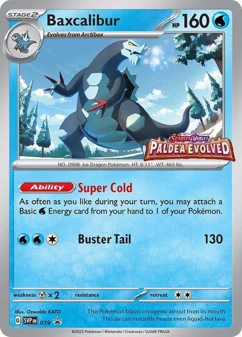
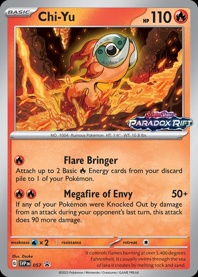
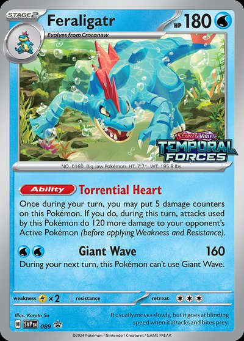

### [crosshatch/](crosshatch/)
Cards with crosshatch holographic pattern, typically from League promos.
*10 images*

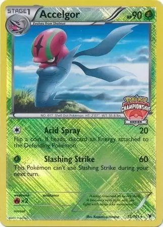
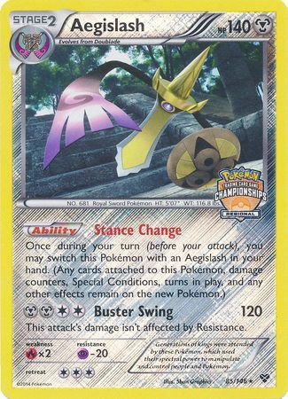
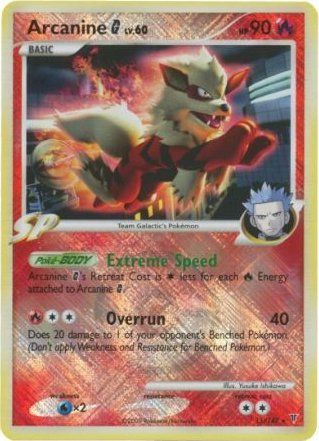

### [crystal/](crystal/)
e-Card era Crystal-type cards with translucent/crystal artwork effect. Very rare.
*9 images*

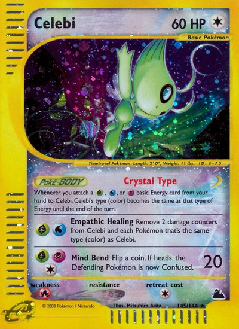
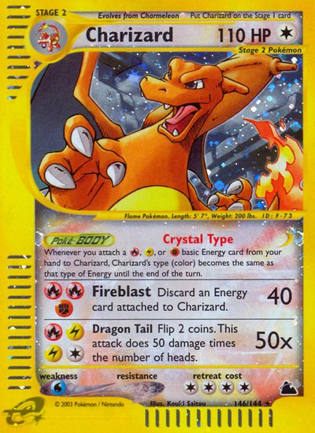
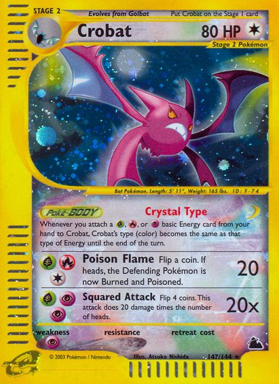

### [errors_misprints/](errors_misprints/)
Various printing errors: wrong energy symbols, missing damage, color errors.
*20 images*

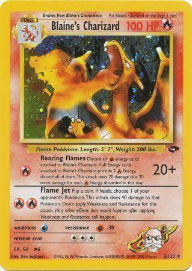
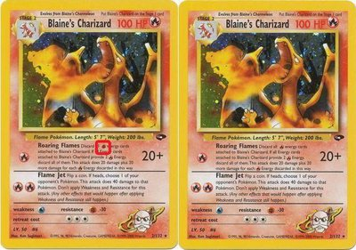
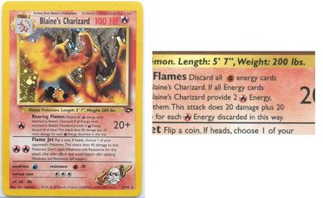

### [grey_stamp/](grey_stamp/)
Cards with grey/silver authentication stamps (CGC, SNCB). Manufacturing mark, not a variant per se.
*13 images*

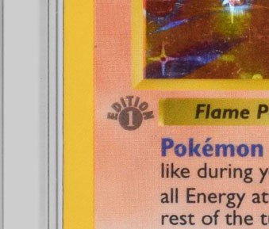
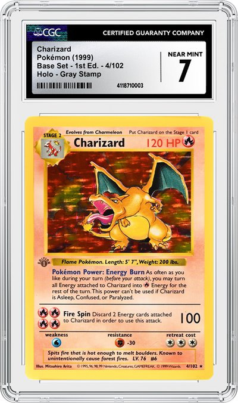
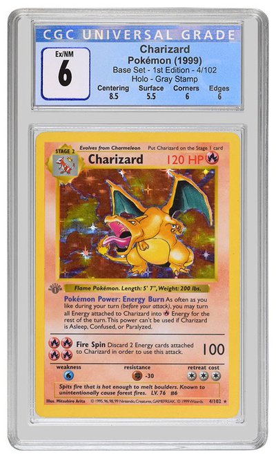

### [holo_patterns/](holo_patterns/)
Different holographic foil patterns: cosmos, cracked ice, confetti, starlight, linear, galaxy.
*33 images*

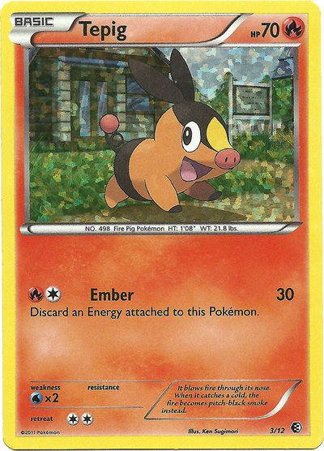
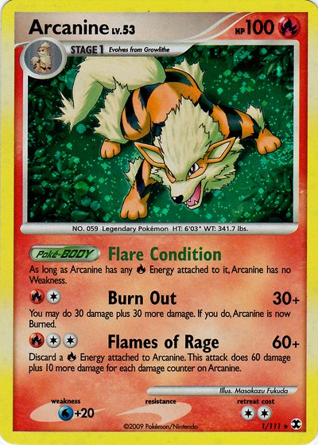
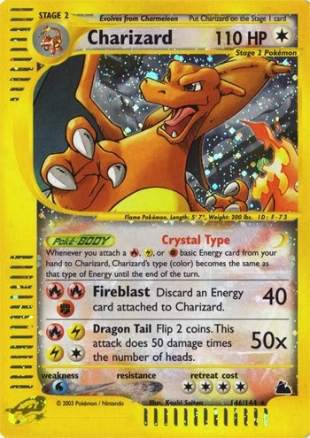

### [holo_vs_nonholo/](holo_vs_nonholo/)
Same card exists in both holofoil and non-holo versions (e.g., Team Rocket set).
*34 images*

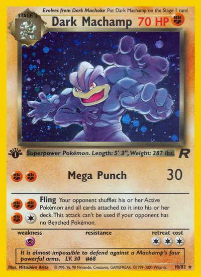
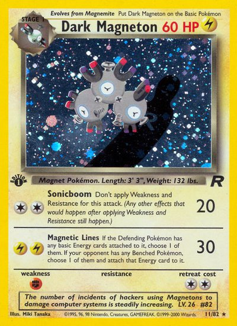
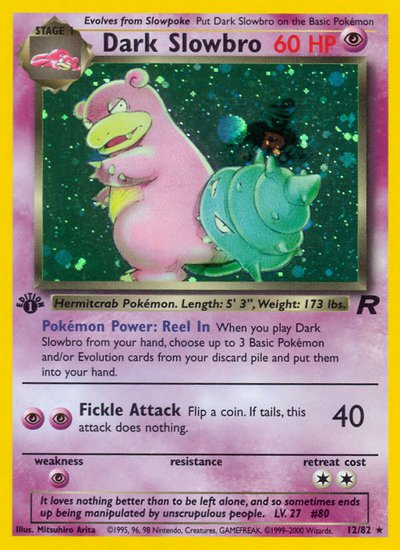

### [mcdonalds/](mcdonalds/)
McDonald's Happy Meal promotional Pokemon cards with confetti holo pattern.
*25 images*

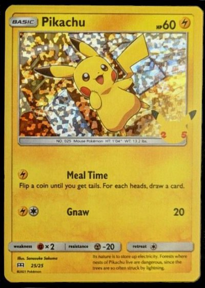
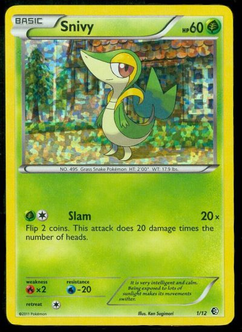
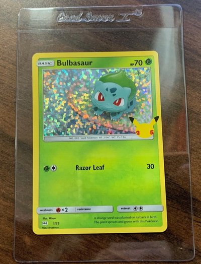

### [no_symbol_error/](no_symbol_error/)
Jungle/Fossil cards mistakenly printed without the set symbol. Error cards.
*37 images*

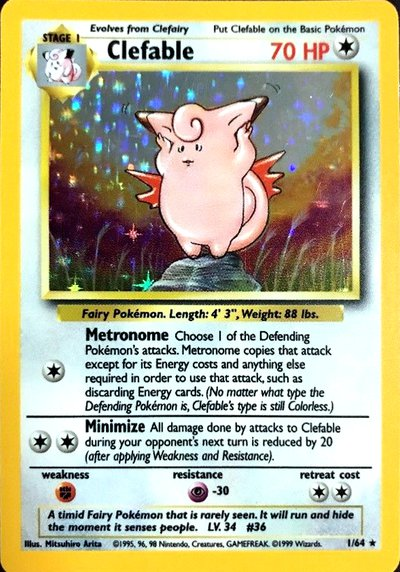
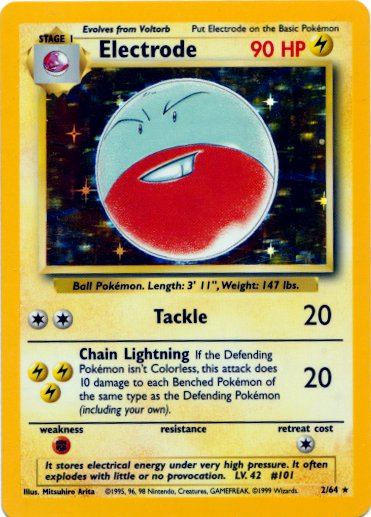
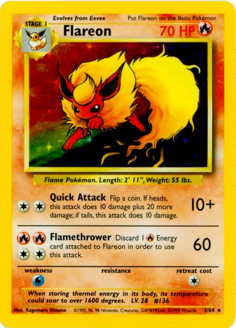

### [pokemon_center/](pokemon_center/)
Cards exclusive to Pokemon Center stores/online.
*10 images*

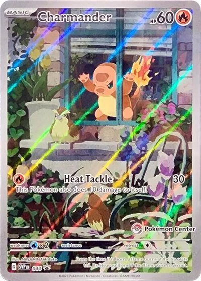
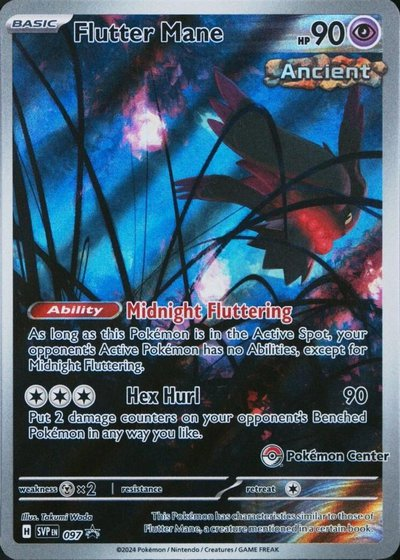
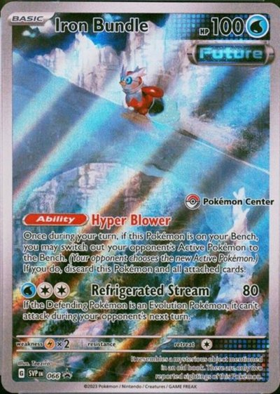

### [prerelease/](prerelease/)
Cards with PRERELEASE or STAFF stamp from pre-release tournaments.
*46 images*

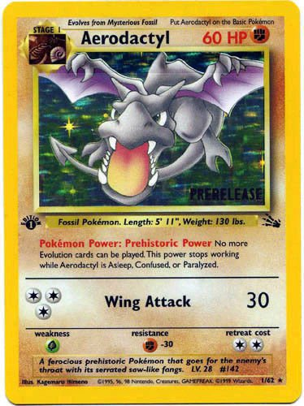
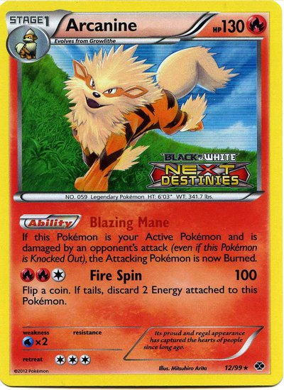
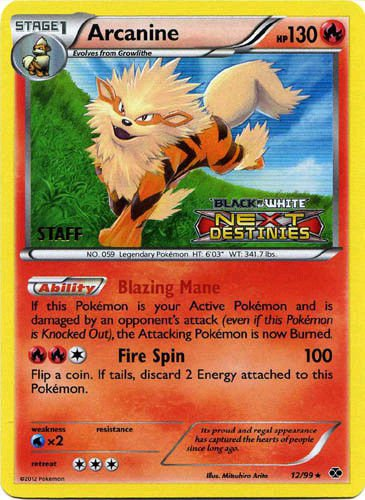

### [promo/](promo/)
Promotional cards distributed through events, products, or special offers. Black star promo symbol.
*75 images*

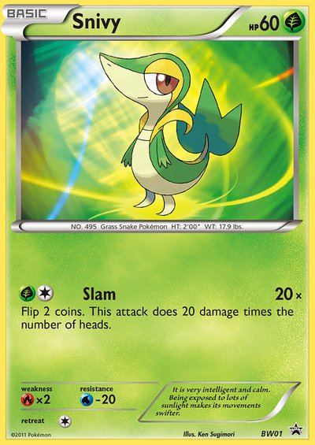
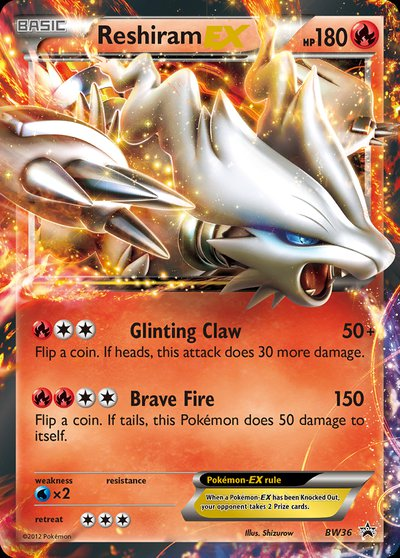
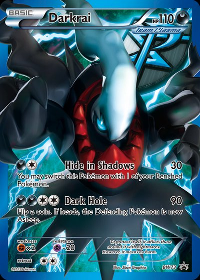

### [retailer_stamps/](retailer_stamps/)
Cards with retailer-specific stamps (Toys R Us, Build-A-Bear).
*10 images*

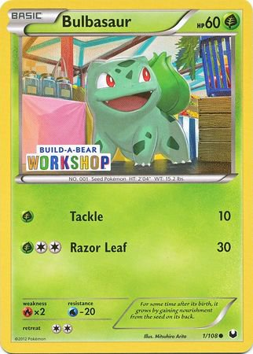
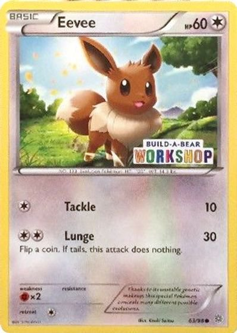
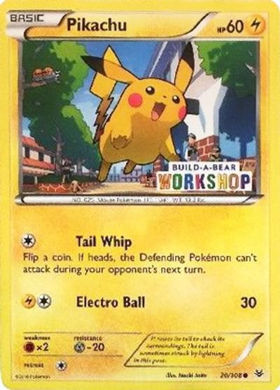

### [reverse_holo/](reverse_holo/)
Cards with holographic foil on the non-art portions. Pattern varies by era (e.g., Legendary Collection stamped, EX series rainbow).
*66 images*

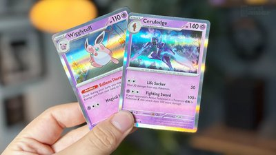
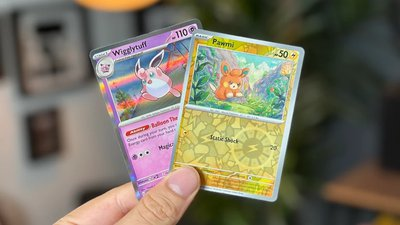
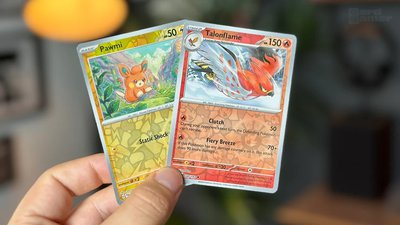

### [shadowless/](shadowless/)
Base Set cards printed without the shadow border on the right side of the card art frame. Rarer than Unlimited.
*41 images*

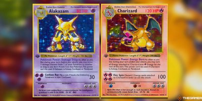
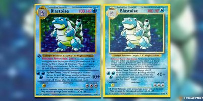

### [shining/](shining/)
Neo-era cards with 'Shining' prefix and holographic Pokemon art on dark background.
*10 images*

### [unlimited/](unlimited/)
Standard Base Set 2 / Legendary Collection prints with shadow border. The most common variant.
*73 images*

